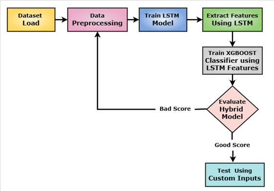
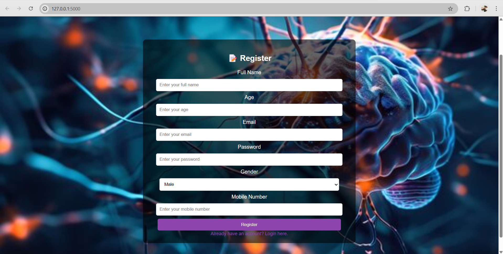
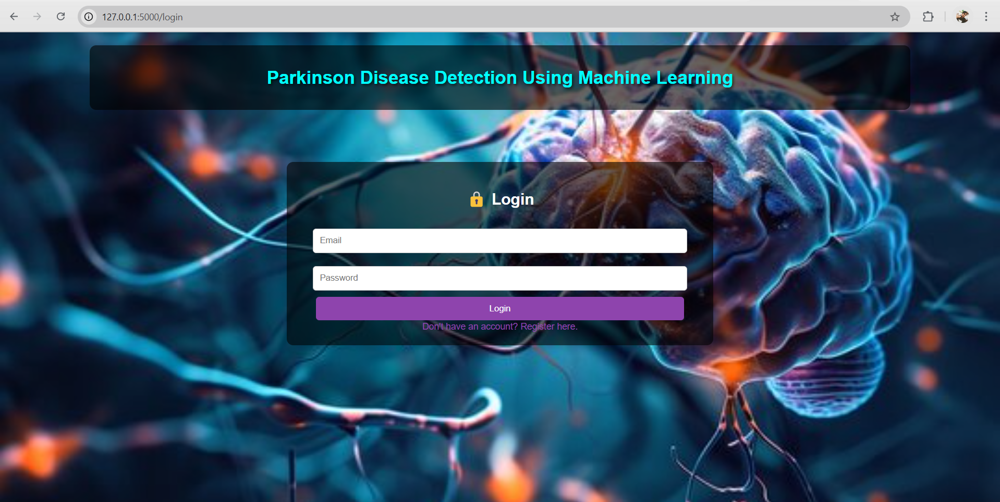
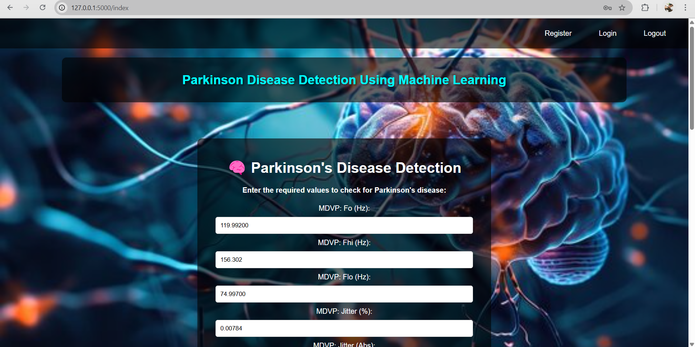
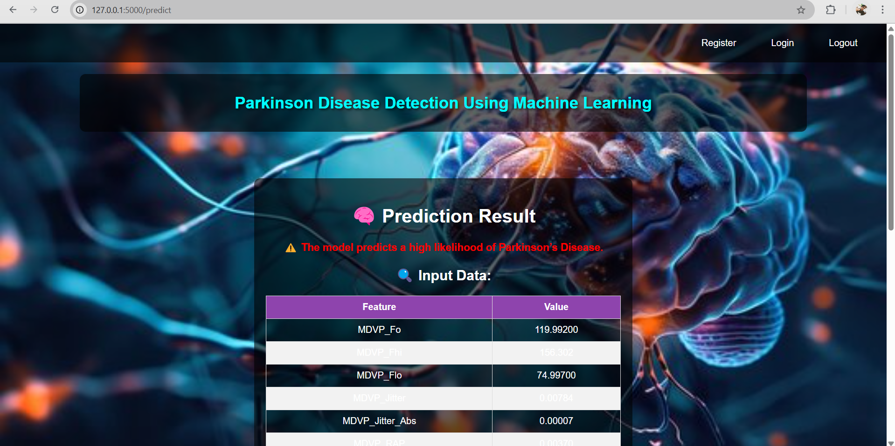

# 🧠 Hybrid XGBoost + LSTM for Early Parkinson’s Disease Detection Using Voice Data

A hybrid machine learning project that combines **LSTM** and **XGBoost** models for early and non-invasive detection of Parkinson’s Disease using voice data. The project includes a web-based interface built with **Flask** for real-time prediction and patient interaction.

## 📝 Abstract

This project presents a **hybrid ML model** using LSTM for sequential voice feature extraction and XGBoost for classification. The system enables real-time PD prediction through a simple web interface, making it a scalable, cost-effective, and non-invasive solution ideal for early detection and telemedicine applications.

---

## 🎯 Objectives

- ✅ Build a hybrid LSTM + XGBoost model for voice-based PD diagnosis
- ✅ Extract vocal features such as MFCCs, jitter, shimmer
- ✅ Improve performance using SMOTE, standardization, and tuning
- ✅ Deploy a user-friendly Flask web app
- ✅ Ensure scalability and remote accessibility

---

## 🔍 Problem Statement

- Late diagnosis due to reliance on neurologists and expensive imaging
- 90% of PD patients show vocal impairments, but voice is underutilized
- Existing ML models lack time-sequence feature analysis
- Absence of real-time, accessible screening tools

---

## 🚀 Proposed System

- **Hybrid ML Model:**
  - `LSTM` for time-series voice feature extraction
  - `XGBoost` for classification with high accuracy
- **Web Interface:**
  - Secure login, voice input, and prediction output
  - Cloud-ready, scalable for remote medical use

---

## 🛠️ Tools & Technologies

| Category             | Tools/Technologies                              |
|----------------------|--------------------------------------------------|
| Programming Languages | Python, HTML, CSS, JavaScript                   |
| ML/DL Frameworks     | TensorFlow, Keras, XGBoost, Scikit-learn        |
| Web Framework        | Flask                                            |
| Visualization        | Matplotlib, Seaborn                             |
| Data Handling        | Pandas, NumPy                                    |
| Model Optimization   | SMOTE, GridSearchCV                              |
| Deployment           | Flask Web Server                                 |
| Storage              | SQLite, Pickle, Joblib                           |

---

## 🔄 Methodology

1. **Data Collection & Preprocessing:** Voice data with pitch, jitter, shimmer, etc.
2. **Feature Selection:** Using XGBoost feature importance
3. **Model Training:** Hybrid LSTM + XGBoost
4. **Evaluation:** Accuracy, Precision, Recall, F1-score, ROC-AUC
5. **Web Deployment:** Flask app for real-time predictions

---

## 📊 Results

| Model               | Accuracy | Precision | Recall | F1-score | ROC-AUC |
|---------------------|----------|-----------|--------|----------|---------|
| **Hybrid (LSTM+XGB)** | 0.97     | 0.97      | 1.00   | 0.98     | 0.99    |
| XGBoost Only        | Lower    | Lower     | Lower  | Lower    | Lower   |
| LSTM Only           | Lower    | Lower     | Lower  | Lower    | Lower   |

---

## 🧪 Functional Requirements

- ✅ Secure User Login
- ✅ Voice Feature Input
- ✅ Real-Time PD Prediction
- ✅ Results Visualization
- ✅ Data Storage for Analysis

---

## 🔐 Non-Functional Requirements

- 🔒 Data Security & Encryption
- 🌐 Responsive & Usable Web Design
- ☁️ Cloud Scalability & Uptime
- ⚡ Fast Prediction & Low Latency

---

## 🌐 Web Application Screenshots

 

## 🧠 Conclusion

Our hybrid LSTM + XGBoost model outperforms traditional diagnostic techniques and standalone ML models in detecting Parkinson’s Disease from voice signals. It has strong potential for integration into real-world telemedicine systems and mass-scale early screening programs.

---

## 💡 Future Work

- Integrate mobile-based voice data collection
- Expand dataset for multilingual voice samples
- Integrate with hospital EMR systems

---
